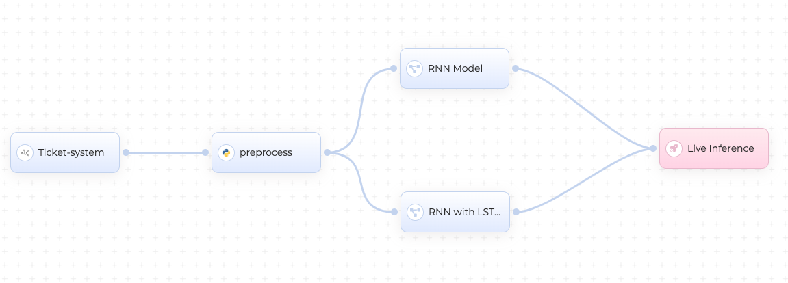

# Ticketclassifier

Suppose you have a customer support ticket system where users submit tickets describing their issues or inquiries. You want to automatically classify these tickets into different categories to route them to the appropriate support teams. The model can help identify the type of issue based on the ticket description, allowing for faster and more efficient ticket management. 

In this scenario, you can train the text classification model using a dataset of labeled support tickets. Each ticket can have a label corresponding to the specific category or type of issue it belongs to. For example:

| Ticket Text                           | Label               |
|---------------------------------------|---------------------|
| "Cannot login to my account"           | Login Issues        |
| "Payment not going through"            | Payment Problems    |
| "Product not working after update"     | Technical Issues    |
| "Need assistance with installation"    | Installation Help   |

The training process involves using a labeled dataset specific to cnvrg.io support tickets to teach the model to recognize patterns and characteristics associated with different categories of issues.

Once the model is trained and deployed, you can utilize the provided Flask application to accept new support tickets via a POST request to the /predict endpoint. The ticket's text is passed within the JSON payload, and the model predicts the appropriate category based on the ticket description. The predicted category is then returned as a JSON response.

For example, if a user submits a support ticket with the text "Cannot login to my account", the model predicts the label "Login Issues". This information can be used to route the ticket to the support team responsible for handling login-related problems. This information can be utilized to route the ticket to the support team responsible for handling login-related problems within the cnvrg.io platform.

By automating the ticket classification process, you can streamline your customer support workflow, ensure faster ticket resolution, and improve overall customer satisfaction.

Remember to train the model using a relevant dataset of cnvrg.io support tickets specific to your domain or application. Additionally, customize the labels list in the code to match the categories or labels you have defined for your support tickets.

# Deployment and Inference

With cnvrg, you can easily deploy your code and model as a lightweight REST API for web services. cnvrg automatically wraps your code and model, exposing it to the web and generating an authentication token to protect the endpoint usage. Additionally, cnvrg provides comprehensive model tracking and monitoring tools, enabling you to effortlessly monitor the performance and usage of your deployed model. With these features, cnvrg simplifies the process of deploying and managing your web services, ensuring secure access and providing valuable insights into your model's performance.

In the predict.py, the labels list is updated to match the specific categories or types of issues associated with the support tickets. You can customize the labels as needed based on your dataset.

The Flask application provides the /predict endpoint to accept POST requests with a JSON payload containing the "text" field, representing the ticket text. The code tokenizes the text, performs the forward pass through the model, and returns the predicted label as a JSON response.

Once the Flask application is running, you can make POST requests to the /predict endpoint, providing the ticket text in the JSON payload, and receive the predicted label in the response.

# Generate your dataset

This code generates a CSV file named "support_tickets.csv" with two columns: "Ticket Description" and "Category". It populates the file with example ticket descriptions and their corresponding categories.

Feel free to customize the ticket_descriptions and ticket_categories lists to add more examples or modify them based on your specific use case. Once you run the code, it will create the CSV file in the specified path with the ticket information.
